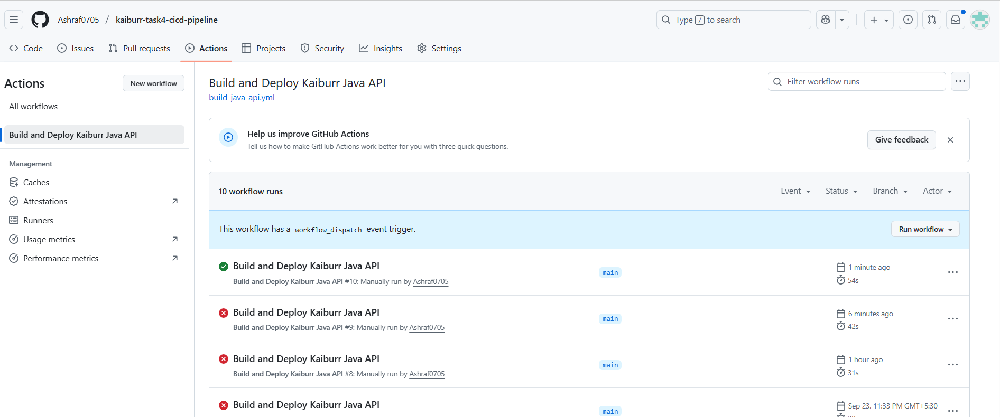
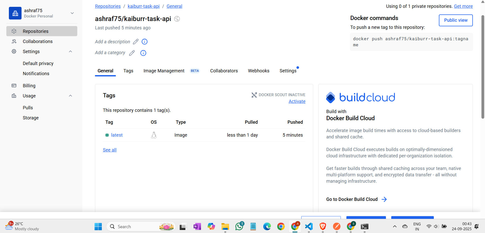

# Kaiburr Technical Assessment - Task 4: CI/CD Pipeline

This repository contains the solution for **Task 4**, an automated CI/CD pipeline built with **GitHub Actions**.

The purpose of this pipeline is to automate the build, testing, and containerization process for the Java Spring Boot application developed in Task 1, demonstrating a key aspect of modern DevOps practices.

---

## 🚀 Pipeline Architecture

This pipeline is designed as a standalone workflow that operates on a separate application repository, a common and robust pattern for managing deployments and separating concerns.

- **Trigger:** The workflow is configured to be triggered manually (`workflow_dispatch`), allowing for controlled and deliberate deployments.
- **Source Repository:** It checks out the source code from the `kaiburr-task1-java-api` repository.
- **Continuous Integration (CI):** It compiles and packages the Java application using Maven. This step implicitly validates the code's integrity and ensures it is in a buildable state.
- **Continuous Deployment (CD):** It builds a Docker image from the application's `Dockerfile` and pushes the resulting versioned image to a public Docker Hub repository, making the artifact available for deployment.

---

## 🛠️ Workflow Steps

The pipeline consists of a single job with the following key steps, executed sequentially on a fresh Ubuntu runner:

1.  **Checkout Source Code:** Securely checks out the `main` branch of the `kaiburr-task1-java-api` repository into a clean workspace.
2.  **Set up JDK 17:** Prepares the runner environment with the correct Java version (Eclipse Temurin) required by the application.
3.  **Build with Maven:** Compiles the source code, resolves dependencies, and creates the final executable `.jar` file.
4.  **Login to Docker Hub:** Authenticates with Docker Hub using encrypted credentials (`DOCKERHUB_USERNAME`, `DOCKERHUB_TOKEN`) stored as GitHub Actions secrets.
5.  **Build and Push Docker Image:** Builds the Docker image and pushes it to the public registry, tagged and ready for deployment.

---

## ✅ Proof of Successful Execution

The following screenshots provide definitive evidence of a successful pipeline run and the resulting artifact.

### 1. Successful Workflow Run
*The screenshot below shows a successful execution of the pipeline, with all steps completing with a green checkmark in the GitHub Actions tab.*

  

---

### 2. Published Docker Image
*This screenshot from Docker Hub confirms that the pipeline successfully built and pushed the `kaiburr-task-api:latest` image to the public registry.*

  

